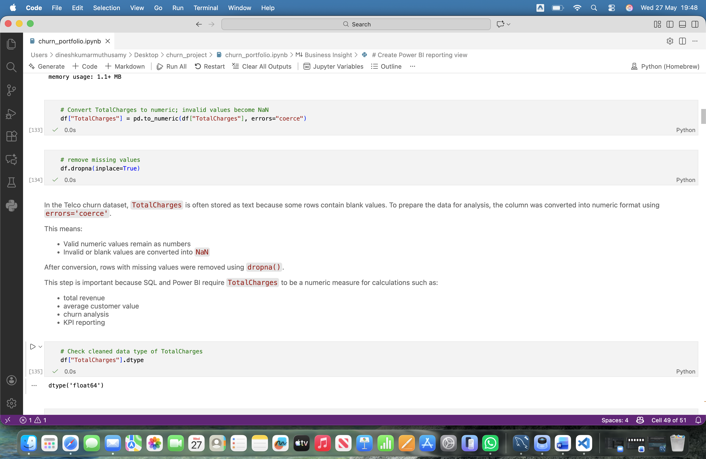
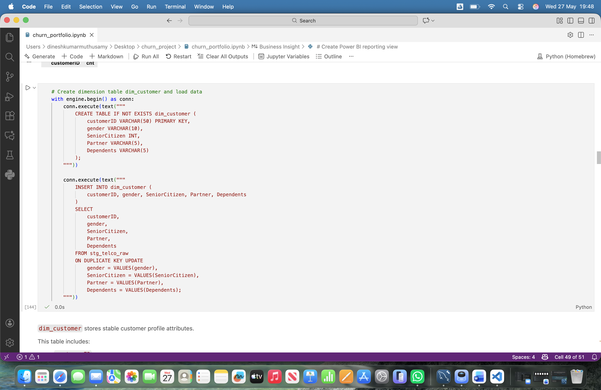
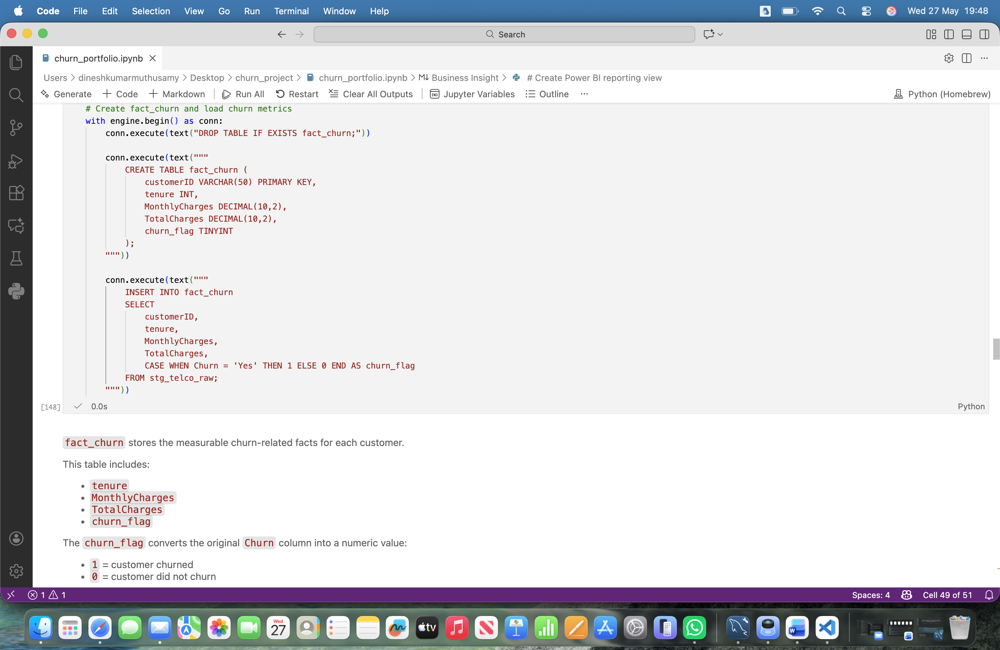
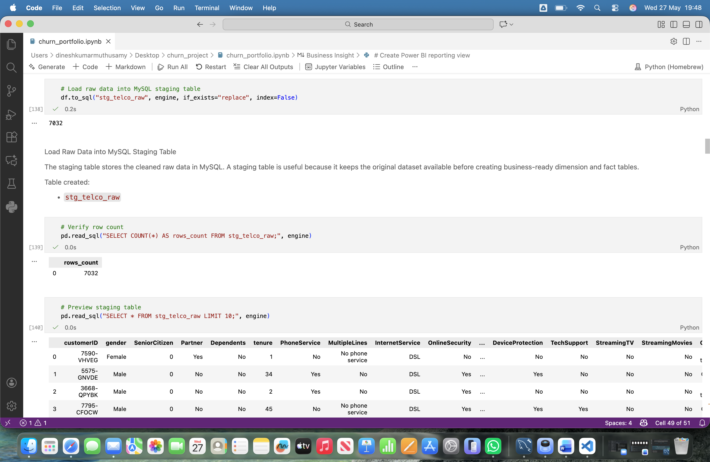
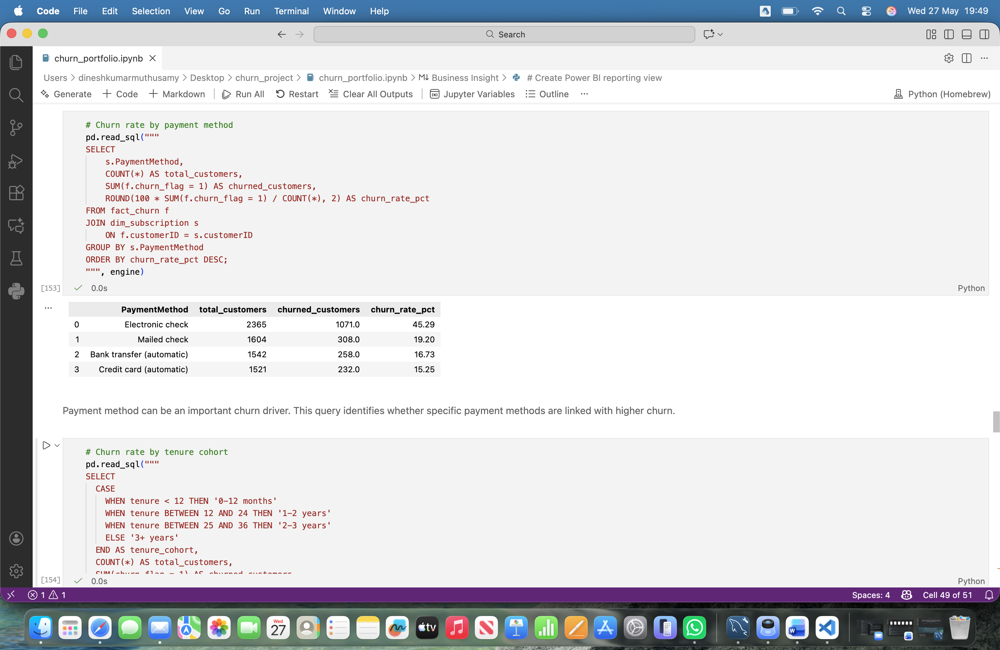
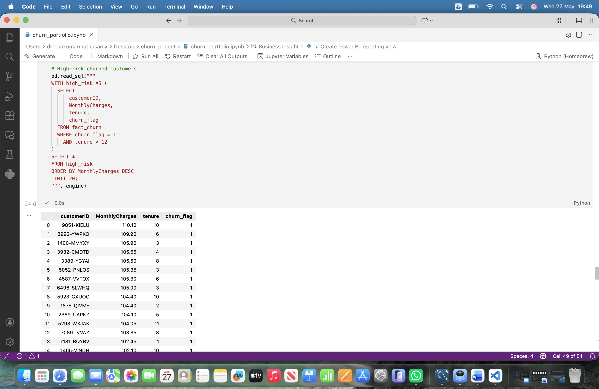
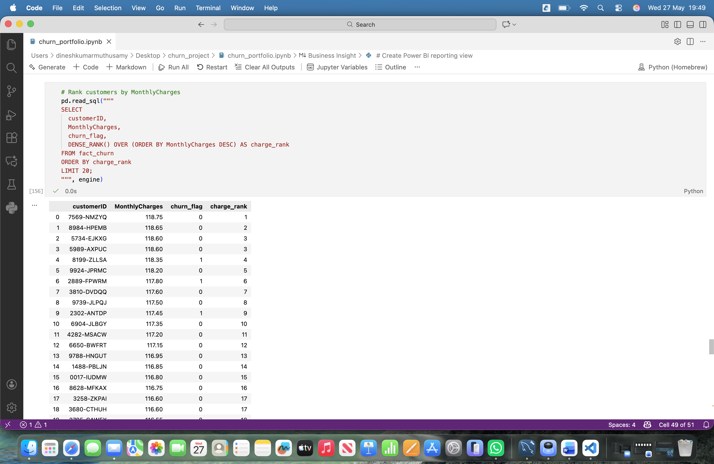
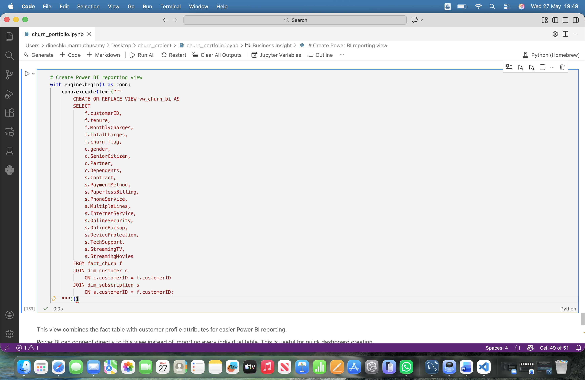
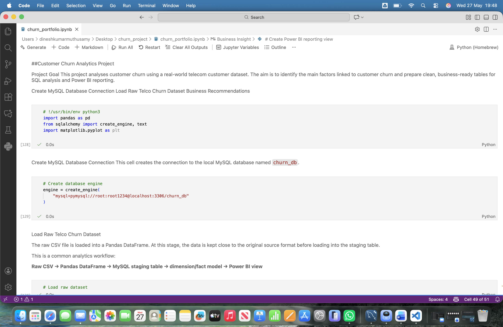

# End-to-End Customer Churn Analytics Project

## Project Overview

This project is an end-to-end customer churn analytics solution built using Python, Pandas, MySQL, SQL, and Power BI.

The goal of the project is to analyze customer churn behavior, identify high-risk churn customers, calculate churn KPIs, and generate business insights that can help improve customer retention strategies.

The project follows a complete analytics workflow:

Raw Dataset → Python Data Cleaning → MySQL Data Modeling → SQL Analytics → Power BI Reporting

---

## Business Problem

Customer churn is one of the biggest challenges for subscription-based businesses.

This project helps answer questions such as:

- Which customers are most likely to churn?
- Which payment methods have the highest churn rate?
- How does customer tenure impact churn?
- Which customer groups require retention strategies?
- What business actions can reduce churn?

---

## Tools & Technologies

- Python
- Pandas
- MySQL
- SQLAlchemy
- SQL
- Power BI
- Jupyter Notebook

---

## Dataset

Dataset used:

- Telco Customer Churn Dataset

Main features include:

- customer demographics
- subscription details
- contract types
- payment methods
- monthly charges
- churn status

---

## Project Workflow

1. Load raw CSV data using Pandas
2. Clean and preprocess the dataset
3. Convert data types and handle missing values
4. Create MySQL staging tables
5. Build dimension and fact tables
6. Perform SQL churn analysis
7. Create Power BI reporting views
8. Generate business insights and recommendations

---

## Data Cleaning

Key data cleaning steps:

- Converted `TotalCharges` into numeric format
- Removed invalid blank values using `errors='coerce'`
- Removed missing rows using `dropna()`
- Checked for null values and duplicates
- Standardized churn flag values

### Data Cleaning Screenshot



---

## Data Modeling

The project uses a dimensional data model:

### Dimension Tables

- `dim_customer`
- `dim_subscription`

### Fact Table

- `fact_churn`

The fact table stores measurable churn-related metrics including:

- tenure
- MonthlyCharges
- TotalCharges
- churn_flag

### Dimension Table Screenshot



### Fact Table Screenshot



---

## MySQL Staging Layer

A staging table was created to store raw transformed customer data before dimensional modeling.

### Staging Table Screenshot



---

## SQL Business Analysis

Several SQL analyses were performed including:

- overall churn rate
- churn by payment method
- churn by contract type
- churn by tenure cohort
- high-risk churn customers
- customer ranking using window functions

### Overall Churn Analysis


### Churn by Payment Method



### High-Risk Churn Customers



### Window Function Analysis



---

## Power BI Reporting View

A SQL reporting view (`vw_churn_bi`) was created for Power BI dashboard integration.

The reporting layer helps simplify KPI reporting and dashboard creation.

### Power BI Reporting View



---

## Key Business Insights

The analysis identified several important churn patterns:

- Month-to-month contract customers had the highest churn rate
- Customers using electronic check payments churned more frequently
- Customers with shorter tenure were more likely to churn
- Higher monthly charges were associated with increased churn risk

---

## Business Recommendations

Based on the analysis:

- Promote long-term contracts
- Improve onboarding for new customers
- Provide retention offers for high-risk customers
- Encourage automatic payment methods
- Monitor customers with high monthly charges

---

## Project Screenshots

### Project Overview



---

## Repository Structure

```text
end-to-end-customer-churn-analytics/
│
├── data_raw/
├── screenshots/
├── churn_portfolio.ipynb
└── README.md
Author
Dinesh Kumar Muthusamy
GitHub: https://github.com/DineshKumar748
LinkedIn: https://linkedin.com/in/dinesh-kumar-muthusamy-856399333/
